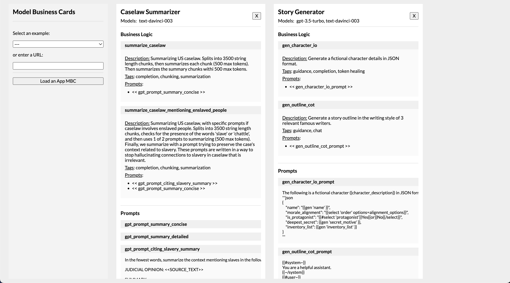

# 📇 Model Business (Logic) Cards 📇

> Inspired by "[Model Cards for Model Reporting](https://arxiv.org/abs/1810.03993)" and the continued work of some of its authors [Timnit Gebru](https://twitter.com/timnitGebru) and [Margaret Mitchell](https://twitter.com/mmitchell_ai).

Model Business Cards is a proof of concept, and Python package for generating documentation about the use of generative AI models focused on LLMs. As the AI community has pushed for better transparency about the biases and behaviors of models through the publishing of "Model Cards", we now have to push one step further into implementation decisions. 

This is inspired by my desire to see builders in the goverment, legal, and social services share best practices and be easily auditable.


## Goals

There are two goals:
- Creating a python package that generates documentation of LLM usage and chaining logic.
  - Documentation of business logic and prompts needs to live at the code leve, so it can be maintained.
  - Generate a single artifact for the repo/app.
  - Should be easily parseable/readable by a person without any extra tooling.
- Creating a web viewer to inspect/compare Model Business Cards across repos, services, orgs.
  - At the very least, shares prompts and considerations of generative models
  - In the future, includes challenges, iterations, learnings, and warnings about the business logic case




## Syntax for Business Logic/Prompts (Work in Progress)

There are two entities we want to document, `ModelBusiness` and `ModelBusinessPrompt`. The MBC package will scan all files in a repo for docstrings that contain yaml blocks. You can keep whatever documentation you have in them, and just at the bottom append a YAML block enclosed by triple dashes. For references, check the /examples directory ([1](https://github.com/youmustfight/model-business-cards/blob/main/examples/story_generator/gen_character_io.py)) ([2](https://github.com/youmustfight/model-business-cards/blob/main/examples/caselaw_summarizer/summarize_caselaw.py))

`ModelBusiness` docstring example on a python function:
```
---
ModelBusiness:
    business_logic: Generate a fictional character details in JSON format.
    models:
        - text-davinci-003
    tags:
        - guidance
        - completion
        - token healing
    prompts:
        - << gen_character_io_prompt >>
---
```

`ModelBusinessPrompt` docstring example on a variable/const:
```
---
ModelBusinessPrompt:
    name: gen_character_io_prompt
    prompt: |
        The following is a fictional character ({character_description}) in JSON format.
        '''json
        {
            "name": "{{gen 'name' }}",
            "morale_alignment": "{{select 'order' options=alignment_options}}",
            "is_protagonist": "{{#select 'protagonist'}}Yes{{or}}No{{/select}}",
            "deepest_secret": {{gen 'secret_motive' }},
            "inventory_list": {{gen 'inventory_list' }}
        }
        '''
---
```


## Generating your Model Business Card (via python package)

You can install the WIP package locally by running `pip install -e .` from the root of this repo.

Then, go to any the package locally on a repo (`python -m modelbusinesscards`), 


## Open Questions/Thoughts

- Should the output be a YAML, JSON, or markdown file?
- What other things should be documented on buinsess logic blocks (better work flows distinctions, models used at each prompt) and prompt blocks (change log, warnings, biases)?
- What other ways might we want to parse or look up documentation? Does it make sense in line with docstrings, or should it be done elsewhere (ex: string/data structure at the top of a file)?
